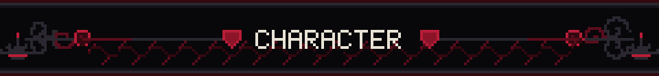
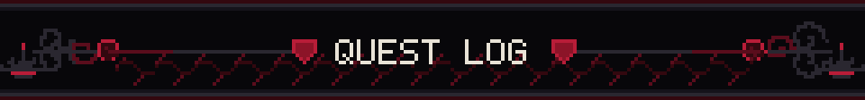
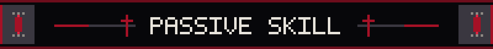
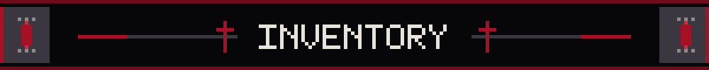
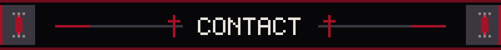

<div align="center">


<sub><b>Final-year B.Sc. Computer Science</b> &nbsp;†&nbsp; ranked 1st of cohort &nbsp;†&nbsp; applying for graduate study in ML security &amp; reliability<br><i>Three complete studies below. Every number links to the repository that produced it.</i></sub>

</div>



```
╔═══ + CHARACTER SHEET + ══════════════════════════════════════════════════╗
║  NAME      Hosein Abdollahi                                              ║
║  CLASS     Adversarial Researcher / Measurement Specialist               ║
║  GUILD     Shahid Chamran University of Ahvaz                            ║
║  RANK      1st of cohort -- B.Sc. Computer Science                       ║
║  ALIGNMENT Lawful Empirical                                              ║
╠══════════════════════════════════════════════════════════════════════════╣
║  " When a learned system fails, how do you know it actually              ║
║    failed -- and not that your instrument lied to you? "                 ║
╚══════════════════════════════════════════════════════════════════════════╝
```

```
╔═══ FOCUS ════════════════════════════════════════════════════════════════╗
║                                                                          ║
║  ADVERSARIAL ML          ██████████████████░░░░  ICS + injection         ║
║  EVALUATION DESIGN       ████████████████████░░  power + guards          ║
║  LLM RELIABILITY         █████████████████░░░░░  code + security         ║
║  MODEL INTERNALS         ████████████░░░░░░░░░░  pruning, redundancy     ║
║  NLP                     ██████████░░░░░░░░░░░░  emotion mapping         ║
║                                                                          ║
║  ▓ distribution of effort across the repositories below,                 ║
║  ▓ not a claim of mastery.                                               ║
║                                                                          ║
╚══════════════════════════════════════════════════════════════════════════╝
```



```
╔═══ QUEST I ══════════════════════════════════════════════════════════════╗
║  I. INVERSE SCALING IN CODE REASONING            [ COMPLETE ]            ║
╠══════════════════════════════════════════════════════════════════════════╣
║  Ports Gema et al. (TMLR 2025) to code reasoning across a                ║
║  non-reasoning and a native-reasoning model.                             ║
║                                                                          ║
║  > Reasoning IMPROVED accuracy .......... 0.41 -> 0.81  (R1)             ║
║  > Distractors at zero budget ........... 0.875 -> 0.562                 ║
║                                            p = 0.011  +                  ║
║  > One line of chain-of-thought erased the effect entirely               ║
║  > Power analysis fixes the floor at ..... n ~ 400 / cell                ║
║                                                                          ║
║  DROP: Wilson intervals | Fisher exact | six integrity guards            ║
╚══════════════════════════════════════════════════════════════════════════╝
```
<sub>▸ <a href="https://github.com/Hosein-Abdollahi/inverse-scaling-in-code">inverse-scaling-in-code</a></sub>

<div align="center"></div>

```
╔═══ QUEST II ═════════════════════════════════════════════════════════════╗
║  II. LLM SECURITY GATEWAY                        [ COMPLETE ]            ║
╠══════════════════════════════════════════════════════════════════════════╣
║  Four defenses, one fixed agent, six injection styles --                 ║
║  the agent held constant so the gateway is the only variable.            ║
║                                                                          ║
║  > Provenance guard blocked EVERY attempted attack                       ║
║  > False positives ....................... 0.000                         ║
║  > Benign utility cost ................... none                          ║
║  > Every content filter left a different hole                            ║
║                                                                          ║
║  REVELATION: detection rate is a vanity metric --                        ║
║  83% of attacks flagged, almost none prevented.                          ║
╚══════════════════════════════════════════════════════════════════════════╝
```
<sub>▸ <a href="https://github.com/Hosein-Abdollahi/provenance-gateway">provenance-gateway</a> | <a href="https://github.com/Hosein-Abdollahi/mcp-injection-guard">mcp-injection-guard</a></sub>

<div align="center"></div>

```
╔═══ QUEST III ════════════════════════════════════════════════════════════╗
║  III. ATTENTION HEAD PRUNING                     [ COMPLETE ]            ║
╠══════════════════════════════════════════════════════════════════════════╣
║  Sensitivity-based head pruning built from scratch, measured             ║
║  against a random baseline it has to beat to justify itself.             ║
║                                                                          ║
║  > GPT-2 ............... importance wins 8 / 9 fractions                 ║
║  > DistilGPT-2 ......... importance wins 4 / 9 -- and LOSES              ║
║                          to random in the 20-50% range                   ║
║                                                                          ║
║  REVELATION: importance pruning only beats random where                  ║
║  redundancy survives. A distilled model is where it does not.            ║
╚══════════════════════════════════════════════════════════════════════════╝
```
<sub>▸ <a href="https://github.com/Hosein-Abdollahi/head-pruning">head-pruning</a></sub>

<div align="center"></div>

```
╔═══ ACTIVE QUESTS ════════════════════════════════════════════════════════╗
║  IV. SWaT -- ICS ATTACK DETECTION                 [  ACTIVE  ]           ║
║  V.  PYRRHIC OPTIMIZATION                        [  ACTIVE  ]            ║
╠══════════════════════════════════════════════════════════════════════════╣
║  Two manuscripts in preparation with Dr. M. Kheirkhahzadeh:              ║
║  a four-layer hybrid model defending industrial control                  ║
║  systems against adversarial and functional attacks, and an              ║
║  empirical study of whether LLM code optimisations trade                 ║
║  security away for speed.                                                ║
╚══════════════════════════════════════════════════════════════════════════╝
```



```
╔═══ PASSIVE ABILITY ══════════════════════════════════════════════════════╗
║                                                                          ║
║        +  " D I S T R U S T   T H E   F L A T T E R I N G                ║
║                        N U M B E R "  +                                  ║
║                                                                          ║
║   When a result favours the active hypothesis, roll to detect            ║
║   instrument error before reporting.                                     ║
║                                                                          ║
╠══════════════════════════════════════════════════════════════════════════╣
║  CONFIRMED CATCHES                                                       ║
║                                                                          ║
║  + THE HELPFUL DISTRACTOR                                                ║
║    Some "distractors" quietly contained the answer.                      ║
║    Measured penalty -3.000: the model did three times BETTER             ║
║    with the distractor, because it was help. The execution               ║
║    check passed it happily -- it was testing the wrong thing.            ║
║                                                                          ║
║  + THE TRUNCATION FALLBACK                                               ║
║    At a 400-token ceiling every hard trace was cut mid-thought,          ║
║    and the extractor was scoring partial accumulators AT CHANCE.         ║
║                                                                          ║
║  + THE ATTEMPT RATE                                                      ║
║    An agent that never tries the attack scores identically to            ║
║    a defense that blocks it. One is a result. One is a weak model.       ║
║                                                                          ║
║  + THE DISCRIMINATION GUARD                                              ║
║    If importance scores do not spread, "prune the least                  ║
║    important" is just "prune at random" -- and the pipeline              ║
║    still emits a clean-looking frontier.                                 ║
║                                                                          ║
║  + THE POWER FLOOR                                                       ║
║    n = 32 detects ~0.35. Real effects are ~0.10. Reporting an            ║
║    absence without that number is reporting nothing at all.              ║
║                                                                          ║
╚══════════════════════════════════════════════════════════════════════════╝
```



```
╔═══ INVENTORY ════════════════════════════════════════════════════════════╗
║  LANGUAGES    Python | C | C++ | Java | MIPS Assembly                    ║
║  ML / AI      PyTorch | Transformers | scikit-learn | XGBoost            ║
║  AGENTS       MCP | Ollama | RAG                                         ║
║  CRAFT        fixed seeds | exact response caching |                     ║
║               per-episode traces | Wilson | Fisher exact                 ║
║  RELICS       Django | FastAPI | MySQL | MongoDB                         ║
╚══════════════════════════════════════════════════════════════════════════╝
```



<div align="center">

<p align="center">
  
</p>
<p align="center">
  
</p>

<sub>
<a href="mailto:H.abdollahi2005@gmail.com">H.abdollahi2005@gmail.com</a> &nbsp;†&nbsp; <a href="https://hosein-abdollahi.github.io">hosein-abdollahi.github.io</a> &nbsp;†&nbsp; <a href="https://www.linkedin.com/in/hosein-abdollahi-b97031422/">LinkedIn</a>
</sub>

<sub><i>Every result above links to a repository carrying its own methodology,<br>its limitations, and the numbers that did not work out.</i></sub>

</div>
